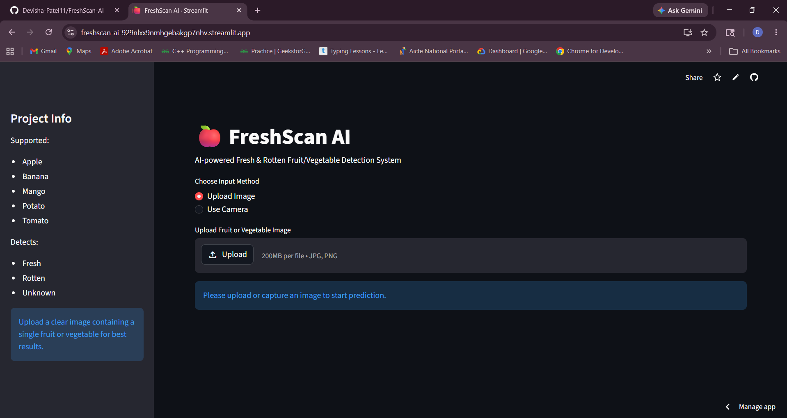
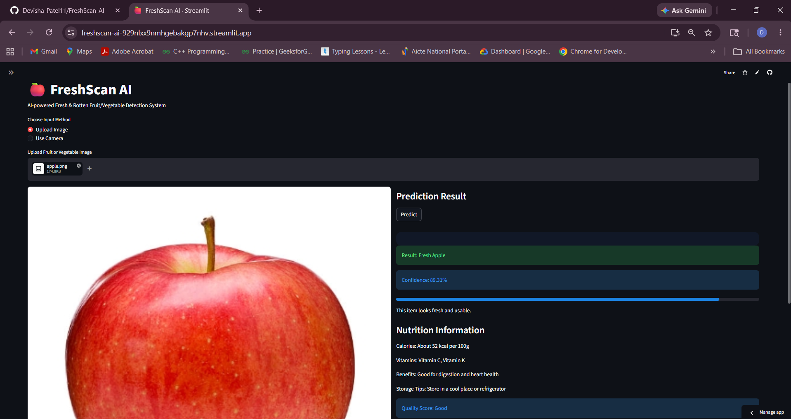
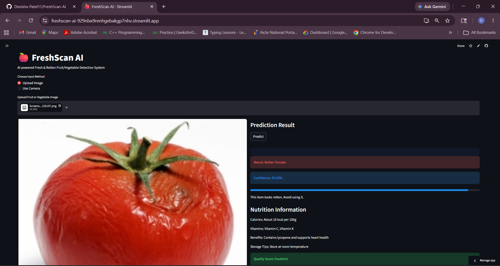
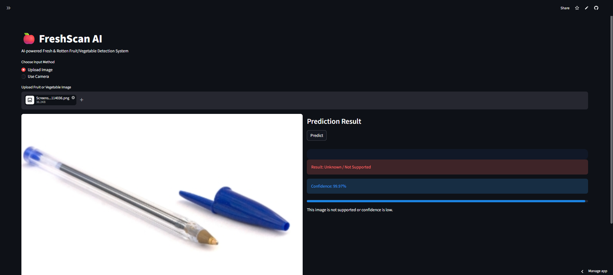
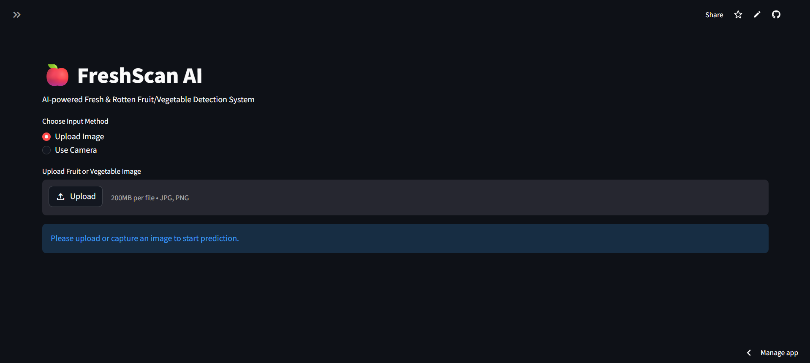
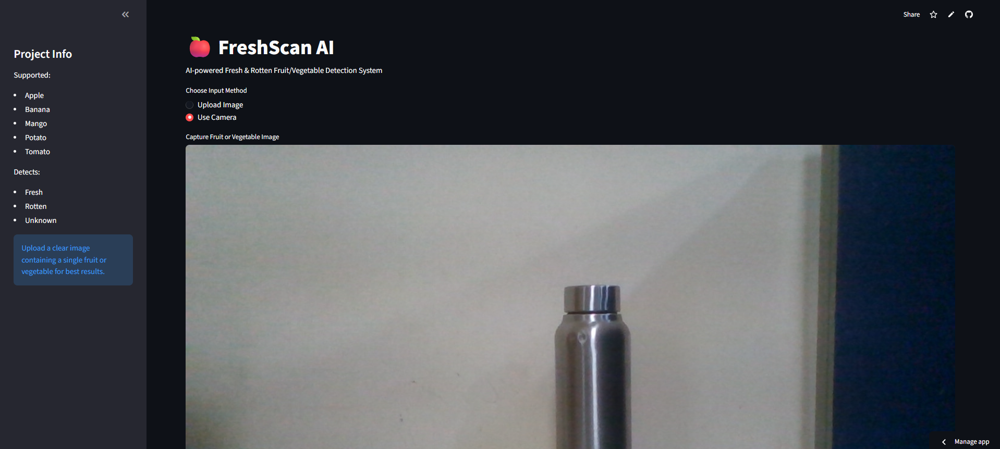

# FreshScan AI

FreshScan AI is a Fruit and Vegetable Recognition System built using Python, TensorFlow, CNN, and Streamlit.

## Live Demo
https://freshscan-ai-929nlxx9nmhgebakgp7nhv.streamlit.app/

## Features

- Fruit and vegetable freshness detection
- Supports fresh and rotten classification for:
  - Apple
  - Banana
  - Mango
  - Potato
  - Tomato
- Unknown object handling
- Image upload prediction
- Webcam image capture
- Confidence score display
- Nutrition information
- Light and dark theme support
- Streamlit web app

## Tech Stack
- Python
- TensorFlow/Keras
- Streamlit
- NumPy
- Pillow
- Matplotlib

## Screenshots

### Home UI


### Fresh Prediction


### Rotten Prediction


### Unknown Object Detection


### Mode(Upload Image/Use Camera)


### Camera Mode



## How to Run

```bash
pip install -r requirements.txt
streamlit run app.py
